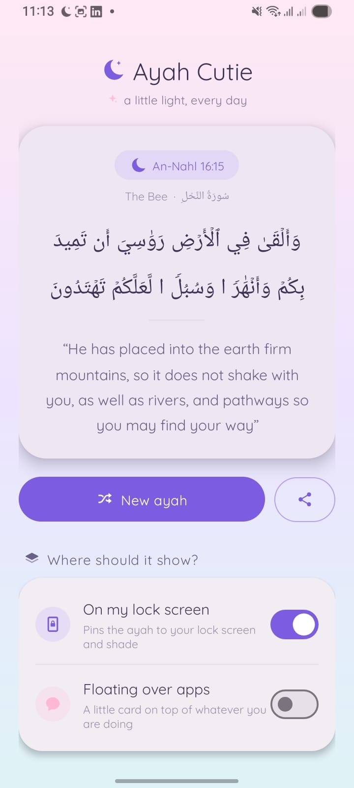
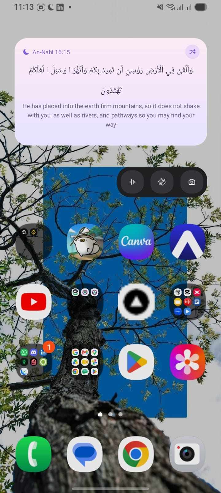

<div align="center">

# 🌙 Ayah Cutie

**A random verse from the whole Qur'an, on your lock screen and over your apps.**

*a little light, every day*

[](https://github.com/Asad-noob69/Cute-Quran-Reminders/releases/latest/download/AyahCutie.apk)
[](#installing)
[](#privacy)
[](LICENSE)

</div>

---

Ayah Cutie keeps one verse from the Qur'an quietly in front of you all day. It sits on
your lock screen, floats over whatever app you're using, and lives on your home screen as
a widget — then swaps itself for a new ayah on a timer you choose.

All 6,236 verses are baked into the app. It never touches the network, and it never asks
to.

<div align="center">


&nbsp;&nbsp;


<sub><b>Left:</b> the app itself &nbsp;·&nbsp; <b>Right:</b> the floating card, sitting on top of everything else</sub>

</div>

---

## ✨ What it does

| | |
|---|---|
| 📖 **The whole Qur'an, offline** | All 6,236 verses bundled in the APK — Uthmani Arabic plus Dr. Mustafa Khattab's *The Clear Quran* translation. Nothing is downloaded, ever. |
| 🔒 **On your lock screen** | A silent notification puts the ayah where you'll see it every time you pick up your phone. |
| 💬 **Floating over your apps** | A soft little card on top of whatever you're doing. Drag it anywhere, shrink it to a moon chip, or dismiss it. |
| 🏠 **Home screen widget** | The same ayah on your home screen, with a shuffle button. |
| ⏰ **On your schedule** | A new ayah every 15 minutes, hour, 3 hours or 6 hours. Every surface stays in sync. |
| 🌸 **Made to be pretty** | Pastel gradients, rounded cards, Amiri Quran for the Arabic and Quicksand for everything else. |
| 🤫 **Never makes a sound** | No pings, no buzzes, no badges. It just sits there being nice. |

---

## 📥 Installing

### **[⬇️ Download AyahCutie.apk](https://github.com/Asad-noob69/Cute-Quran-Reminders/releases/latest/download/AyahCutie.apk)**

That link always serves the newest build — no GitHub account needed, no page to hunt
through. You can also browse [all releases](https://github.com/Asad-noob69/Cute-Quran-Reminders/releases) if you want an older version.

1. Open the downloaded `AyahCutie.apk` on your phone.
2. Android will ask you to allow **Install unknown apps** for your browser or file
   manager — that's normal for any app installed outside the Play Store.
3. Open **Ayah Cutie** and flip on the switches you want:
   - **On my lock screen** asks for the notification permission.
   - **Floating over apps** sends you to Android's *Display over other apps* screen.

To add the widget: long-press your home screen → **Widgets** → **Ayah Cutie**.

---

## 📱 Samsung / One UI users, read this

One UI ships with lock screen notifications set to **icons only**, so the verse text
stays hidden no matter what the app does. It's a one-time fix:

> **Settings → Lock screen → Notifications → View style → `Details`**
> and make sure **Show content** is on.

Tap the lock-screen hint at the bottom of the app to jump straight there.

While you're in Settings, add the app to **Battery → Background usage limits →
Never sleeping apps**, or One UI will eventually put the refresh timer to sleep.

One honest limitation: Samsung's **Always On Display** only ever renders notification
*icons* for third-party apps, so the verse appears on the real lock screen, not on AOD.
Nothing an app can do about that one.

Other heavy-handed skins — MIUI, ColorOS, Funtouch — have their own equivalent of
"never sleeping apps". If the ayah stops refreshing, that's almost always the culprit.

---

## 🔐 Privacy

There isn't much to say, which is the point.

- **No internet permission.** Not "we don't use it" — the APK genuinely does not declare
  `android.permission.INTERNET`, so it *can't* phone home. Check for yourself:
  `aapt2 dump badging AyahCutie.apk | grep permission`.
- No analytics, no ads, no accounts, no tracking.
- The only thing it stores is which verse you're on and your switch settings.

Permissions it does ask for, and why:

| Permission | Why |
|---|---|
| `POST_NOTIFICATIONS` | To put the ayah on your lock screen |
| `SYSTEM_ALERT_WINDOW` | Only for the floating card — skip it if you don't want that |
| `FOREGROUND_SERVICE` | Keeps the floating card alive while you use other apps |
| `RECEIVE_BOOT_COMPLETED` | Puts the ayah back after you restart your phone |

---

## 🔨 Building it yourself

You'll need **JDK 17** and the **Android SDK** (platform 34, build-tools 34.0.0).

```bash
git clone https://github.com/Asad-noob69/Cute-Quran-Reminders.git
cd Cute-Quran-Reminders
echo "sdk.dir=/path/to/your/Android/Sdk" > local.properties
gradle assembleRelease
```

The APK lands in `app/build/outputs/apk/release/`.

### How it's put together

The interesting design decision is that **the lock-screen ayah doesn't need anything
running**. A plain `AlarmManager` alarm wakes a receiver, which posts the notification and
goes back to sleep. The foreground service exists *only* to hold the floating card on
screen — so if you never turn that on, there's no permanent service notification cluttering
your shade.

The verse notification also lives on its own default-importance channel with sound and
vibration stripped out at the channel level. That sounds fussy, but it's load-bearing:
Android and One UI file *silent* and *ongoing* notifications away where lock screens
render them as bare icons. Silencing the channel instead of the notification is what gets
the verse an actual card on the lock screen.

| File | What it is |
|---|---|
| `Quran.kt` | Reads verses off the bundled asset one line at a time, so nothing holds 2 MB of text in memory |
| `Prefs.kt` | The single shared "which verse are we on" store every surface reads from |
| `VerseNotifier.kt` | Builds and posts the lock-screen notification |
| `VerseScheduler.kt` | The shuffle alarm |
| `VerseActionReceiver.kt` | One entry point for the alarm, the notification buttons and the widget |
| `VerseService.kt` | The floating card, and nothing else |
| `VerseWidget.kt` | The home-screen widget |
| `MainActivity.kt` | The pastel settings screen |
| `assets/quran.txt` | `surah\|ayah\|arabic\|english`, 6,236 lines |

---

## 🤝 Contributing

Issues and pull requests are welcome — especially:

- Reports from other Android skins (MIUI, ColorOS, OxygenOS) about what the lock screen
  actually does
- More translations, or a translation picker
- Tasteful theme variants

---

## 🙏 Credits

- Qur'an text and translation from the [fawazahmed0/quran-api](https://github.com/fawazahmed0/quran-api) dataset
- English translation: *The Clear Quran* by Dr. Mustafa Khattab
- Fonts: [Amiri Quran](https://fonts.google.com/specimen/Amiri+Quran) and [Quicksand](https://fonts.google.com/specimen/Quicksand), both under the SIL Open Font License

## 📄 License

The app's own source code is MIT licensed — see [LICENSE](LICENSE).

Note that the bundled **translation text is not** yours or mine to relicense; *The Clear
Quran* remains the copyright of its publisher, and the MIT licence covers only the code
in this repository. If you fork this into something commercial, sort out the translation
rights first.

<div align="center">
<br>
<sub>Built with love. May it be of benefit. 🤍</sub>
</div>
